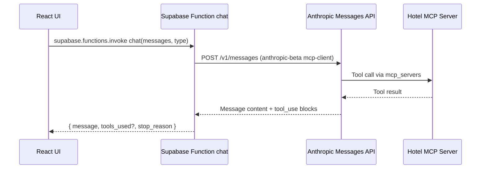

# looking.com Frontend

Production-ready React + TypeScript frontend for a conversational hotel search and booking experience. It integrates i18n, shadcn UI, Supabase Edge Functions, and Anthropic MCP tools to query a hotel MCP server during chat flows.

## Key capabilities
- Conversational search and booking flows in [src/pages/Chat.tsx](src/pages/Chat.tsx:1) and [src/pages/Hotel.tsx](src/pages/Hotel.tsx:1)
- Admin analytics dashboard in [src/pages/Admin.tsx](src/pages/Admin.tsx:1)
- Multilingual UX via [src/i18n/config.ts](src/i18n/config.ts:1)
- Supabase client in [src/integrations/supabase/client.ts](src/integrations/supabase/client.ts:1) and serverless chat function in [supabase/functions/chat/index.ts](supabase/functions/chat/index.ts:1)
- Tailwind design system in [src/index.css](src/index.css:1) with theme tokens wired in [tailwind.config.ts](tailwind.config.ts:1)


## Quickstart

### Requirements
- Node 18+ and npm
- A Supabase project with an Edge Function named `chat`
- An Anthropic API key with MCP client beta enabled

### Install and run
- Copy required environment variables into a local `.env`

#### Example .env
```
VITE_SUPABASE_URL=your_supabase_url
VITE_SUPABASE_PUBLISHABLE_KEY=your_supabase_anon_key
```

- Install and start
```
npm install
npm run dev
```

### Build and preview
```
npm run build
npm run preview
```


## Architecture overview

### Frontend entrypoints
- App bootstrap and i18n init in [src/main.tsx](src/main.tsx:1)
- Routing and providers in [src/App.tsx](src/App.tsx:1) using React Router and React Query
- Global navigation in [src/components/Navigation.tsx](src/components/Navigation.tsx:1)

### Pages
- Chat: [src/pages/Chat.tsx](src/pages/Chat.tsx:1)
- Hotel landing: [src/pages/Hotel.tsx](src/pages/Hotel.tsx:1)
- Admin dashboard: [src/pages/Admin.tsx](src/pages/Admin.tsx:1)
- Booking confirmation: [src/pages/BookingConfirm.tsx](src/pages/BookingConfirm.tsx:1)
- Not found: [src/pages/NotFound.tsx](src/pages/NotFound.tsx:1)

### UI and design system
- Tailwind tokens and theming in [src/index.css](src/index.css:1) and [tailwind.config.ts](tailwind.config.ts:1)
- shadcn UI primitives in [src/components/ui](src/components/ui:1)
- Utility for class merging [src/lib/utils.ts](src/lib/utils.ts:1)
- Toast system (shadcn) [src/components/ui/toaster.tsx](src/components/ui/toaster.tsx:1) + [src/hooks/use-toast.ts](src/hooks/use-toast.ts:1)

### Internationalization
- All copy lives in [src/i18n/config.ts](src/i18n/config.ts:1) with `de` and `en` namespaces
- The language toggle is in [src/components/Navigation.tsx](src/components/Navigation.tsx:1)

### Backend integration
- Supabase client configuration in [src/integrations/supabase/client.ts](src/integrations/supabase/client.ts:1)
- Types scaffolded in [src/integrations/supabase/types.ts](src/integrations/supabase/types.ts:1)
- Edge Function implementation in [supabase/functions/chat/index.ts](supabase/functions/chat/index.ts:1)
- Supabase local config in [supabase/config.toml](supabase/config.toml:1)


## How chat connects to the MCP server

### End-to-end flow
- The Chat page collects messages and calls the Supabase Edge Function:
  - In [src/pages/Chat.tsx](src/pages/Chat.tsx:1), `handleSend` uses `supabase.functions.invoke('chat', { body: { messages }})`
  - In [src/pages/Hotel.tsx](src/pages/Hotel.tsx:1), `handleSendMessage` does the same with `type: "hotel"` to apply a hotel-optimized system prompt
- The Edge Function forwards to Anthropic with MCP enabled:
  - [supabase/functions/chat/index.ts](supabase/functions/chat/index.ts:44) posts to `https://api.anthropic.com/v1/messages`
  - It includes header `anthropic-beta: mcp-client-2025-04-04` to enable MCP client features
  - It passes `mcp_servers` with your remote MCP server URL [supabase/functions/chat/index.ts](supabase/functions/chat/index.ts:60)
  - Anthropic routes tool calls to the MCP server and returns normal text plus optional `tools_used` metadata
- The function extracts text blocks and returns a simple JSON payload `{ message, stop_reason, tools_used? }`
- The frontend renders the assistant message into the chat UI

### Sequence diagram


### Edge Function configuration
- API key: set `ANTHROPIC_API_KEY` in your Supabase project environment
- CORS: permissive defaults in [supabase/functions/chat/index.ts](supabase/functions/chat/index.ts:6)
- System prompts and model selection are set per `type` in [supabase/functions/chat/index.ts](supabase/functions/chat/index.ts:27)
- MCP server URL configured in the function config object [supabase/functions/chat/index.ts](supabase/functions/chat/index.ts:34)


## Developing and running locally

1) Environment
- Create `.env` with `VITE_SUPABASE_URL` and `VITE_SUPABASE_PUBLISHABLE_KEY`
- Create Supabase secrets with `ANTHROPIC_API_KEY` for the `chat` function

2) Frontend
- Run dev server
  - `npm run dev`
- Visit `http://localhost:5173`

3) Supabase Edge Function
- Option A: Deploy the function to your Supabase project via dashboard
- Option B: Use Supabase CLI
  - `supabase functions serve chat`
  - `supabase secrets set ANTHROPIC_API_KEY=...`

4) MCP server
- Ensure the MCP server URL in [supabase/functions/chat/index.ts](supabase/functions/chat/index.ts:34) is reachable from the Edge Function


## Adding new features

### Add a new page
- Create a component under [src/pages](src/pages:1)
- Register a route in [src/App.tsx](src/App.tsx:19) inside the `<Routes>` block
- Add a nav entry in [src/components/Navigation.tsx](src/components/Navigation.tsx:14)
- Add i18n keys in [src/i18n/config.ts](src/i18n/config.ts:1)

### Add UI with shadcn
- Prefer reusing existing primitives in [src/components/ui](src/components/ui:1)
- If you need a new shadcn component, generate it and place it under the same folder

### Show a toast
- Use the shadcn toast hook [src/hooks/use-toast.ts](src/hooks/use-toast.ts:166) and provider [src/components/ui/toaster.tsx](src/components/ui/toaster.tsx:1)
- Example
  - `import { toast } from "@/hooks/use-toast"`
  - `toast({ title: "Saved", description: "Your changes are live." })`

### Extend the chat protocol
- Add client-side commands in [src/pages/Chat.tsx](src/pages/Chat.tsx:86) by parsing the input and setting `type` or metadata before calling `supabase.functions.invoke`
- Add server-side behaviour in [supabase/functions/chat/index.ts](supabase/functions/chat/index.ts:27) by:
  - Adding a new `type` branch with `model`, `system`, and `mcpUrl`
  - Or passing multiple entries in `mcp_servers` if your model should access more than one MCP server

### Call another Supabase Function
- Implement a new function under [supabase/functions](supabase/functions:1)
- Invoke it from the client via [src/integrations/supabase/client.ts](src/integrations/supabase/client.ts:1) with `supabase.functions.invoke("your-func", { body })`
- Keep shared DTOs in a `/types` module

### Add or modify translations
- Update keys in [src/i18n/config.ts](src/i18n/config.ts:1)
- Use the `useTranslation` hook where needed and ensure keys exist in both `de` and `en`

### Admin analytics
- API base is configured in [src/pages/Admin.tsx](src/pages/Admin.tsx:16)
- Consider moving `API_BASE_URL` to an environment variable if you need different environments


## Security and secrets
- Do not commit API keys to the repo. Use Supabase function secrets for `ANTHROPIC_API_KEY` and `.env` for publishable client values only
- The file [src/lib/claudeApi.ts](src/lib/claudeApi.ts:1) is a scaffold and should not be used in production; prefer the Edge Function path
- Restrict CORS and verify JWTs if your function should be private. See [supabase/config.toml](supabase/config.toml:3)


## Troubleshooting
- 401 from Supabase: verify `VITE_SUPABASE_URL` and `VITE_SUPABASE_PUBLISHABLE_KEY`
- 401 from Anthropic: ensure `ANTHROPIC_API_KEY` is set for the function
- No MCP tool calls observed: check `anthropic-beta` header and `mcp_servers` configuration in [supabase/functions/chat/index.ts](supabase/functions/chat/index.ts:44)
- Empty responses: log `data.content` in the function; we extract only text blocks


## Roadmap and housekeeping
- Consolidate to a single toast system (shadcn) across the app to reduce deps
- Remove unused UI wrappers and assets when ready
- Move Admin API base URL to environment config


## License
MIT


## Environment & Secrets Management

This project avoids storing real API keys in the repository or local frontend env files.

What’s already done
- Frontend no longer uses a hard-coded key. Calls are routed through the Supabase Edge Function via [src/lib/claudeApi.ts](src/lib/claudeApi.ts:1).
- The Edge Function reads secrets from environment variables (server-side) in [supabase/functions/chat/index.ts](supabase/functions/chat/index.ts:4).
- The MCP server URL is configurable via env: [supabase/functions/chat/index.ts](supabase/functions/chat/index.ts:5).

Do not put Anthropic keys in Vite env
- Never use VITE_CLAUDE_API_KEY or similar. Any VITE_* variable is exposed to the browser.
- The server-side key must be read via Deno.env in the Edge Function.

Secrets you need to provide (server-side)
- ANTHROPIC_API_KEY: your Anthropic API key used by the Edge Function
- MCP_URL: the MCP server URL used by the Edge Function (previously hard-coded)

Supabase Function secrets (production)
- Using the Supabase CLI:
  - supabase secrets set ANTHROPIC_API_KEY=sk-ant-... MCP_URL=https://your-mcp-server.example.com/mcp/capcorn
- The function reads them via Deno.env.get in [supabase/functions/chat/index.ts](supabase/functions/chat/index.ts:4)

Local development (functions)
- Per your policy, do not store real keys locally. Keep supabase/functions/.env empty (it is ignored by git).
- Optional (for local function testing only): create supabase/functions/.env with ANTHROPIC_API_KEY and MCP_URL. Do not commit this file.

Frontend environment (Vite)
- Required (public):
  - VITE_SUPABASE_URL
  - VITE_SUPABASE_PUBLISHABLE_KEY
- Optional:
  - VITE_API_BASE_URL (if you later externalize the Admin API that is currently hard-coded in [src/pages/Admin.tsx](src/pages/Admin.tsx:16))
- See the template in [.env.example](.env.example:1). Your current local [.env](.env:1) is git-ignored.

GitHub Actions: set repository secrets
- Add the following GitHub Secrets (Settings → Secrets and variables → Actions → New repository secret):
  - ANTHROPIC_API_KEY
  - MCP_URL
  - VITE_SUPABASE_URL
  - VITE_SUPABASE_PUBLISHABLE_KEY
  - Optionally: VITE_API_BASE_URL
- Your CI/CD workflow (if/when added) can pass these to the build/deploy steps. Avoid printing them in logs.

Confirmation
- Keys should not be stored in the repo or pushed in commits.
- Production keys live as Supabase Function secrets (for the Edge Function).
- Build-time/public variables live as GitHub Actions secrets (exported as env for the workflow) and are only those prefixed with VITE_ that are safe for the frontend.

Security note
- If any sensitive key was previously committed (e.g., in [src/lib/claudeApi.ts](src/lib/claudeApi.ts:1) before refactor), consider performing a git history purge (e.g., git filter-repo) and rotating the key with your provider.
